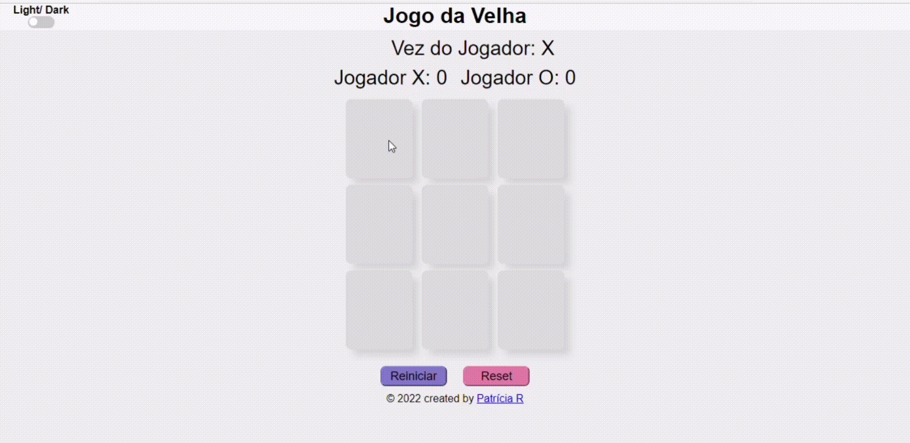
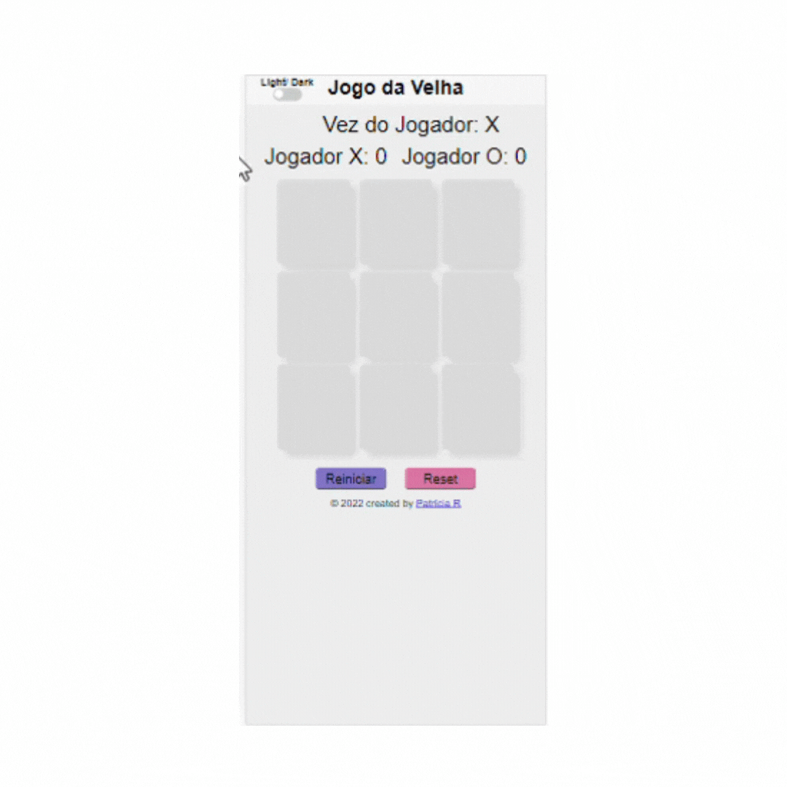

# #️⃣ Criando seu próprio Jogo da Velha - DIO

[Preview](https://github.com/PatriciaRodriguesR/DIO-Jogo-Da-Velha#eye_speech_bubble-preview) • [Description](https://github.com/PatriciaRodriguesR/DIO-Jogo-Da-Velha#information_source-about) • [Technologies](https://github.com/PatriciaRodriguesR/DIO-Jogo-Da-Velha#hammer_and_wrench-technologies) • [Tasks](https://github.com/PatriciaRodriguesR/DIO-Jogo-Da-Velha#memo-tasks) • [License](https://github.com/PatriciaRodriguesR/DIO-Jogo-Da-Velha#page_with_curl-license) • [View Demo](https://PatriciaRodriguesR.github.io/DIO-Jogo-Da-Velha/)

---

## Bootcamp - [Órbi Web Games Developer](https://www.dio.me/bootcamp/orbi-web-game-developer):

### Projeto 1:

## 👁️‍🗨️ **Preview**

Link para visualizar: [View Demo](https://PatriciaRodriguesR.github.io/DIO-Jogo-Da-Velha/)

### 🖥️ Computer

---

### 📱 Mobile

---

## ℹ️ Description

Repositório do projeto prático proposto na aula do Bootcamp - Órbi Web Games Developer da [DIO](https://www.dio.me/), ministrada pelo especialista **Vitor Ruschoni**, com o desafio de desenvolver um jogo da velha, utilizando HTML, CSS and Javascript.

---

## 🛠️ **Technologies**

  

---

## 📝 **Tasks**

- [x] Adicionar placar
- [x] Adicionar favicon
- [x] Apresentação de qual foi o jogador ganhador
- [x] Mudança de cores dos componentes do jogo
- [x] Dark Mode
- [x] Botão de reiniciar partida
- [x] Botão de resetar partida
- [x] Layout responsivo

---

## 📃 License

This project is under the **MIT license**. See the [LICENSE](https://github.com/PatriciaRodriguesR/DIO-Jogo-Da-Velha/blob/master/LICENSE) for more information.

---

Made with 💜 by [**Patrícia Rodrigues**](https://github.com/PatriciaRodriguesR/) 👋
